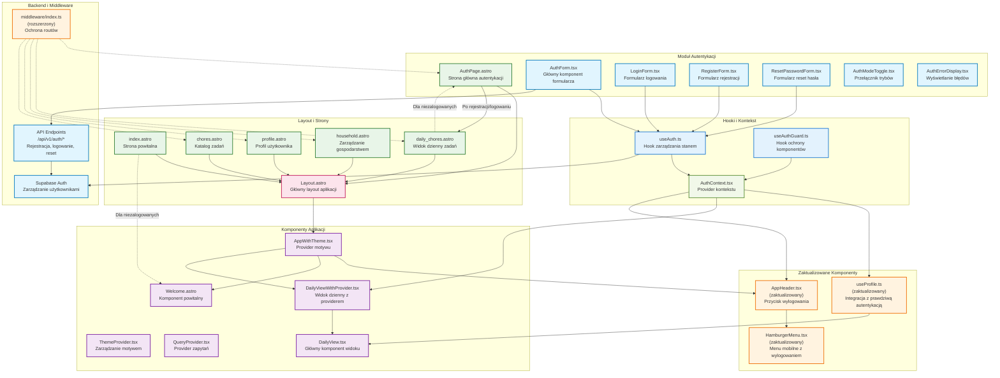

```mermaid
flowchart TD
    %% Definicje stylów
    classDef authComponent fill:#e1f5fe,stroke:#0277bd,stroke-width:2px
    classDef existingComponent fill:#f3e5f5,stroke:#7b1fa2,stroke-width:2px
    classDef updatedComponent fill:#fff3e0,stroke:#ef6c00,stroke-width:2px
    classDef pageComponent fill:#e8f5e8,stroke:#2e7d32,stroke-width:2px
    classDef layoutComponent fill:#fce4ec,stroke:#c2185b,stroke-width:2px
    classDef contextComponent fill:#f1f8e9,stroke:#558b2f,stroke-width:2px
    classDef hookComponent fill:#e3f2fd,stroke:#1976d2,stroke-width:2px

    %% Nowe komponenty autentykacji
    subgraph "Moduł Autentykacji"
        AuthPage["AuthPage.astro<br/>Strona główna autentykacji"]:::pageComponent
        AuthForm["AuthForm.tsx<br/>Główny komponent formularza"]:::authComponent
        LoginForm["LoginForm.tsx<br/>Formularz logowania"]:::authComponent
        RegisterForm["RegisterForm.tsx<br/>Formularz rejestracji"]:::authComponent
        ResetPasswordForm["ResetPasswordForm.tsx<br/>Formularz reset hasła"]:::authComponent
        AuthModeToggle["AuthModeToggle.tsx<br/>Przełącznik trybów"]:::authComponent
        AuthErrorDisplay["AuthErrorDisplay.tsx<br/>Wyświetlanie błędów"]:::authComponent
    end

    %% Hooki autentykacji
    subgraph "Hooki i Kontekst"
        useAuth["useAuth.ts<br/>Hook zarządzania stanem"]:::hookComponent
        useAuthGuard["useAuthGuard.ts<br/>Hook ochrony komponentów"]:::hookComponent
        AuthContext["AuthContext.tsx<br/>Provider kontekstu"]:::contextComponent
    end

    %% Istniejące komponenty zaktualizowane
    subgraph "Zaktualizowane Komponenty"
        AppHeaderUpdated["AppHeader.tsx<br/>(zaktualizowany)<br/>Przycisk wylogowania"]:::updatedComponent
        HamburgerMenuUpdated["HamburgerMenu.tsx<br/>(zaktualizowany)<br/>Menu mobilne z wylogowaniem"]:::updatedComponent
        useProfileUpdated["useProfile.ts<br/>(zaktualizowany)<br/>Integracja z prawdziwą autentykacją"]:::updatedComponent
    end

    %% Layout i strony
    subgraph "Layout i Strony"
        Layout["Layout.astro<br/>Główny layout aplikacji"]:::layoutComponent
        IndexPage["index.astro<br/>Strona powitalna"]:::pageComponent
        DailyChoresPage["daily_chores.astro<br/>Widok dzienny zadań"]:::pageComponent
        HouseholdPage["household.astro<br/>Zarządzanie gospodarstwem"]:::pageComponent
        ProfilePage["profile.astro<br/>Profil użytkownika"]:::pageComponent
        ChoresPage["chores.astro<br/>Katalog zadań"]:::pageComponent
    end

    %% Istniejące komponenty aplikacji
    subgraph "Komponenty Aplikacji"
        AppWithTheme["AppWithTheme.tsx<br/>Provider motywu"]:::existingComponent
        ThemeProvider["ThemeProvider.tsx<br/>Zarządzanie motywem"]:::existingComponent
        QueryProvider["QueryProvider.tsx<br/>Provider zapytań"]:::existingComponent
        Welcome["Welcome.astro<br/>Komponent powitalny"]:::existingComponent
        DailyViewWithProvider["DailyViewWithProvider.tsx<br/>Widok dzienny z providerem"]:::existingComponent
        DailyView["DailyView.tsx<br/>Główny komponent widoku"]:::existingComponent
    end

    %% Middleware i API
    subgraph "Backend i Middleware"
        Middleware["middleware/index.ts<br/>(rozszerzony)<br/>Ochrona routów"]:::updatedComponent
        APIEndpoints["API Endpoints<br/>/api/v1/auth/*<br/>Rejestracja, logowanie, reset"]:::authComponent
        SupabaseAuth["Supabase Auth<br/>Zarządzanie użytkownikami"]:::authComponent
    end

    %% Przepływ danych i zależności

    %% Strony -> Layout
    IndexPage --> Layout
    AuthPage --> Layout
    DailyChoresPage --> Layout
    HouseholdPage --> Layout
    ProfilePage --> Layout
    ChoresPage --> Layout

    %% Layout -> Komponenty aplikacji
    Layout --> AppWithTheme
    AppWithTheme --> AppHeaderUpdated
    AppWithTheme --> Welcome
    AppWithTheme --> DailyViewWithProvider

    %% Autentykacja -> Hooki
    AuthForm --> useAuth
    LoginForm --> useAuth
    RegisterForm --> useAuth
    ResetPasswordForm --> useAuth

    %% Hooki -> Kontekst
    useAuth --> AuthContext
    useAuthGuard --> AuthContext

    %% Kontekst -> Aplikacja
    AuthContext --> useProfileUpdated
    AuthContext --> DailyViewWithProvider
    AuthContext --> AppHeaderUpdated

    %% Zaktualizowane komponenty -> Istniejące
    AppHeaderUpdated --> HamburgerMenuUpdated
    DailyViewWithProvider --> DailyView
    useProfileUpdated --> DailyView

    %% Middleware ochrona
    Middleware -.-> AuthPage
    Middleware -.-> DailyChoresPage
    Middleware -.-> HouseholdPage
    Middleware -.-> ProfilePage
    Middleware -.-> ChoresPage

    %% API integracja
    AuthForm --> APIEndpoints
    APIEndpoints --> SupabaseAuth
    useAuth --> SupabaseAuth

    %% Przepływy użytkownika
    IndexPage -.->|"Dla niezalogowanych"| Welcome
    AuthPage -->|"Po rejestracji/logowaniu"| DailyChoresPage
    DailyChoresPage -.->|"Dla niezalogowanych"| AuthPage

    %% Zaktualizowane komponenty wyróżnione
    AppHeaderUpdated:::updatedComponent
    HamburgerMenuUpdated:::updatedComponent
    useProfileUpdated:::updatedComponent
    Middleware:::updatedComponent
```
